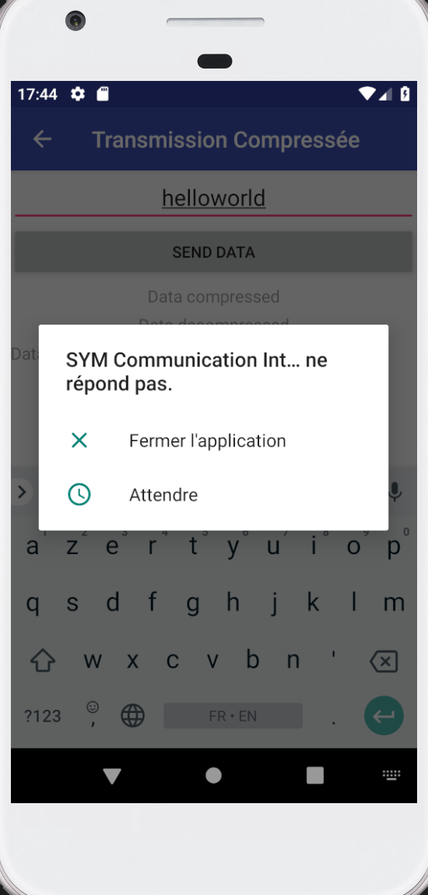

# Systèmes mobiles
## Laboratoire n°2 : Protocoles applicatifs

> Auteurs : Loic Frueh - Koubaa Walid - Muaremi Dejvid  
> Enseignant : Fabien Dutoit  
> Assistants : Christophe Greppin, Valentin Minder  
> Date : 09.10.2018

### 1 Traitement des erreurs
Les interfaces AsyncSendRequest et CommunicationEventListener utilisées au point 3.1 restent très (et certainement trop) simples pour être utilisables dans une vraie application : que se passe-t-il si le serveur n’est pas joignable dans l’immédiat ou s’il retourne un code HTTP d’erreur ? 
Veuillez proposer une nouvelle version, mieux adaptée, de ces deux interfaces pour vous aider à illustrer votre réponse.

### 2 Authentification

**Si une authentification par le serveur est requise, peut-on utiliser un protocole asynchrone ?**

On peut tout à fait mettre en place un système d'authentification en utilisant un protocole asynchrone. On peut obliger les clients à envoyer une token d'authentification à l'intérieur d'un JSON par exemple de chaque requête. Ainsi, le serveur pourra vérifier si le client est authentifié et si sa session est toujours valide.

Bien evidement pour rendre ce type de méthode utilisable, il faudrait mettre en place un formulaire de connexion pour demander au serveur token d'authentification. Si le serveur valide la connexion du client, il lui renvoie un token d'authentificationn unique.

**Quelles seraient les restrictions ?**

 Les restrictions serait de **mettre en place un formulaire de connexion** pour demander au serveur token d'authentification. Si le serveur valide la connexion du client, il lui renvoie un token d'authentificationn unique.

De plus il faudrait prévoir **un champ "session token"** que ce soit dans le xml ou json ou tout autre format pour garantir l'authenticité du client.
 
**Peut-on utiliser une transmission différée ?** 

La transmission différe n'est peut etre pas le meilleur moyen de gere l'authentification car serait "bloquante" pour l'application. 
Bien que celle ci peut etre utilisée, elle posera un probleme de délai d'attente  de la réponse du serveur très long avant de prouver l'authenticité du client.

### 3 Threads concurrents
**Lors de l'utilisation de protocoles asynchrones, c'est généralement deux threads différents qui se préoccupent de la préparation, de l'envoi, de la réception et du traitement des données.  
Quels problèmes cela peut-il poser ?**

L'exécution d'un thread A avant un thread B dépend de la rapidité d'execution et traitement de chaque étape et il se peut qu'une étape s'exécute plus vite que les autres. Le traitement des données ne se fait donc pas dans l'ordre et peut poser problème.

Il faut faire attention aux sections critiques et aux variables partagées, et s'assurer que l'ordre d'execution de chacune des étapes (préparation, envoi, réception) soit bien respecté.

Par exemple, pour  l'authentification évoquée plus haut, il faudrait éviter que le client n'envoie une requête avant d'avoir reçu la clé de session et vérifié l'authenticité de l'envoyeur.

### 4 Ecriture différée
Lorsque l'on implémente l'écriture différée, il arrive que l'on ait soudainement plusieurs transmissions en attente qui deviennent possibles simultanément.  
Comment implémenter proprement cette situation (sans réalisation pratique) ?  

timeout
Voici deux possibilités :
- Effectuer une connexion par transmission différée  
- Multiplexer toutes les connexions vers un même serveur en une seule connexion de transport.  
Dans ce dernier cas, comment implémenter le protocole applicatif, quels avantages peut-on espérer de ce multiplexage, et surtout, comment doit-on planifier les réponses du serveur lorsque ces dernières s'avèrent nécessaires ?  

Comparer les deux techniques (et éventuellement d'autres que vous pourriez imaginer) et discuter des avantages et inconvénients respectifs.

### 5 Transmission d’objets
a. Quel inconvénient y a-t-il à utiliser une infrastructure de type REST/JSON n'offrant aucun service de validation (DTD, XML-schéma, WSDL) par rapport à une infrastructure comme SOAP offrant ces possibilités ?  
Est-ce qu’il y a en revanche des avantages que vous pouvez citer ?  
b. L’utilisation d’un mécanisme comme Protocol Buffers est-elle compatible avec une architecture basée sur HTTP ?  
Veuillez discuter des éventuelles avantages ou limitations par rapport à un protocole basé sur JSON ou XML ?  
c. Par rapport à l’API GraphQL mise à disposition pour ce laboratoire. Avez-vous constaté des
points qui pourraient être améliorés pour une utilisation mobile ?  
Veuillez en discuter, vous pouvez élargir votre réflexion à une problématique plus large que la manipulation effectuée.

### 6 Transmission compressée
**Quel gain peut-on constater en moyenne sur des fichiers texte (xml et json sont aussi du texte)en utilisant de la compression du point 3.4 ?** 

L'activity de compression bien que normalement bien implementée n'envoie pas de requete au serveur faute d'une erreur de connexion internet non trouvée (alors que celle ci fait appel à une requete POST asynchrone qui fonctionne au meme moment). Le code fait bien appel à deflate et inflate pour compresser et decompresser. (nous avons tout essayer pour faire fonctionner la requete transmise au serveur mais sans succès, merci de bien vouloir regarder notre code source de l'activity en question, preuve de notre bonne foi)

 

Neanmoins nous avons pu tester le rapport de compression entre les données textes avant compression et après compression en local en utilisant la compression DEFLATE (sans requete au serveur).
 
 - Pour du texte brut, nous avons par exemple pour un texte très court "Hello" le rapport de compression est proche de 1.5 tandis que pour un texte assez long (300 à 400 caractères) le ratio est de 2.5.

 - Pour du json, le gain est plus élevé car les accolades sont très present pour chaque element. Pour un json simple d'une trentaine de caractères, le ratio est de 2.9
 
 - Pour de l' xml, le gain est aussi élevé car les chevrons des balises sont assez recurrents. Avec un xml simple d'une cinquantaine de caractères, le ratio était de 2.7

**Vous comparerez vos résultats par rapport au gain théorique d’une compression DEFLATE, vous enverrez aussi plusieurs tailles de contenu pour comparer.**

En théorie une compression DEFLATE possède un ratio de 2.9 à 3.3 (c'est a dire que pour un texte de 120 caractères, le texte compressé contiendra 40 à 30 caractères environ).

Bien évidemment la pratique est assez éloigné de la théorie en fonction de la taille du texte à compresser. Par exemple pour un texte très court "Hello" le rapport de compression est proche de 1.5 tandis que pour un texte assez long (300 à 400 caractères) le ratio est de 2.5.

Comme spécifié plus haut cela varie de caractères repeétes dans le texte à compresser, en effet les **balise xml** et les **accolades pour le json** font que le **ratio de compression est en general très elevé**. 

Le taux de compression sur un texte (txt/xml/json) varie donc en moyenne entre 60% et 80%.